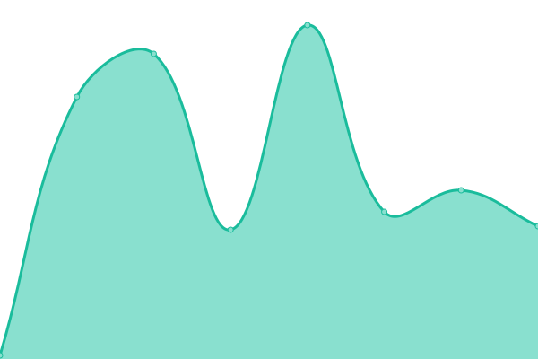

# [📈 Live Status](https://anhtuan2810.github.io/quote-snap-status): <!--live status--> **🟥 Complete outage**

This repository contains the open-source uptime monitor and status page for [anhtuan2810](https://anhtuan2810.github.io/quote-snap-status), powered by [Upptime](https://github.com/upptime/upptime).

With [Upptime](https://upptime.js.org), you can get your own unlimited and free uptime monitor and status page, powered entirely by a GitHub repository. We use [Issues](https://github.com/anhtuan2810/quote-snap-status/issues) as incident reports, [Actions](https://github.com/anhtuan2810/quote-snap-status/actions) as uptime monitors, and [Pages](https://anhtuan2810.github.io/quote-snap-status) for the status page.

<!--start: status pages-->
<!-- This summary is generated by Upptime (https://github.com/upptime/upptime) -->
<!-- Do not edit this manually, your changes will be overwritten -->
<!-- prettier-ignore -->
| URL | Status | History | Response Time | Uptime |
| --- | ------ | ------- | ------------- | ------ |
|  [Redis Service Status](https://api.omegatheme.com/quote-snap/backend/server.php/api/status/redis) | 🟥 Down | [redis-service-status.yml](https://github.com/anhtuan2810/quote-snap-status/commits/HEAD/history/redis-service-status.yml) | 

 219ms
     
 | 

<a href="https://anhtuan2810.github.io/quote-snap-status/history/redis-service-status">44.71%</a>
    

|  [MySQL Service Status](https://api.omegatheme.com/quote-snap/backend/server.php/api/status/mysql) | 🟥 Down | [my-sql-service-status.yml](https://github.com/anhtuan2810/quote-snap-status/commits/HEAD/history/my-sql-service-status.yml) | 

 61ms
     
 | 

<a href="https://anhtuan2810.github.io/quote-snap-status/history/my-sql-service-status">44.71%</a>
    

|  [API Health Status](https://api.omegatheme.com/quote-snap/backend/server.php/api) | 🟥 Down | [api-health-status.yml](https://github.com/anhtuan2810/quote-snap-status/commits/HEAD/history/api-health-status.yml) | 

 67ms
     
 | 

<a href="https://anhtuan2810.github.io/quote-snap-status/history/api-health-status">44.71%</a>
    

<!--end: status pages-->

[**Visit our status website →**](https://anhtuan2810.github.io/quote-snap-status)

## 📄 License

- Powered by: [Upptime](https://github.com/upptime/upptime)
- Code: [MIT](./LICENSE) © [Anand Chowdhary](https://anandchowdhary.com), supported by [Pabio](https://pabio.com)
- Data in the `./history` directory: [Open Database License](https://opendatacommons.org/licenses/odbl/1-0/)
